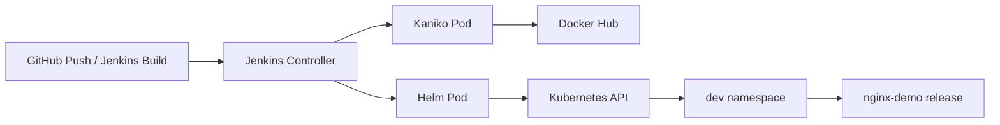

# NGINX Demo on Kubernetes with Jenkins CI/CD


Beginner-friendly, production-style guide for this repo.

This project does:
1. Build Docker image in Kubernetes using Kaniko.
2. Push image to Docker Hub.
3. Deploy/upgrade app to Kubernetes using Helm.
4. Expose app through NGINX Ingress Controller (controller Service type `NodePort`).

---

## Architecture



---

## Repository Layout

```text
.
├── Dockerfile
├── index.html
├── Jenkinsfile
├── helm/
│   └── nginx-demo/
│       ├── Chart.yaml
│       ├── values.yaml
│       └── templates/
└── k8s/
    ├── jenkins-serviceaccount.yaml
    ├── jenkins-deployment.yaml
    └── jenkins-helm-cluster-rbac.yaml
```

---

## Prerequisites

1. Kubernetes cluster up and reachable from your terminal.
2. Jenkins installed in cluster (Helm chart install is shown below).
3. Jenkins Kubernetes plugin installed.
4. Docker Hub account and credential in Jenkins:
   - Credential ID: `dockerhub-creds`
   - Type: `Username with password`
5. GitHub repo connected to Jenkins job.

---

## 1) Install Jenkins in Kubernetes (if not already installed)

```bash
helm repo add jenkins https://charts.jenkins.io
helm repo update

kubectl create namespace jenkins --dry-run=client -o yaml | kubectl apply -f -

helm upgrade --install jenkins jenkins/jenkins \
  -n jenkins \
  --set controller.serviceType=NodePort
```

Check:

```bash
kubectl get pods -n jenkins
kubectl get svc -n jenkins
```

---

## 2) Install NGINX Ingress Controller as NodePort

If you get `repo ingress-nginx not found`, add repo first.

```bash
helm repo add ingress-nginx https://kubernetes.github.io/ingress-nginx
helm repo update

helm upgrade --install ingress-nginx ingress-nginx/ingress-nginx \
  -n ingress-nginx \
  --create-namespace \
  --set controller.service.type=NodePort
```

Verify controller:

```bash
kubectl get pods -n ingress-nginx
kubectl get svc -n ingress-nginx
```

---

## 3) Jenkins ServiceAccount + Cluster RBAC

Apply the service account:

```bash
kubectl apply -f k8s/jenkins-serviceaccount.yaml
```

Apply cluster-wide Helm RBAC (for multi-namespace deployments like `dev`, `qa`, `prod`):

```bash
kubectl apply -f k8s/jenkins-helm-cluster-rbac.yaml
```

Verify access:

```bash
kubectl auth can-i list secrets --as=system:serviceaccount:jenkins:jenkins -n dev
```

Expected output: `yes`

---

## 4) Jenkins Job Setup

1. Create a Pipeline job.
2. Set Pipeline definition: `Pipeline script from SCM`.
3. SCM: `Git`.
4. Repo URL: your GitHub repo.
5. Script path: `Jenkinsfile`.
6. Save and click `Build with Parameters`.

---

## 5) Pipeline Parameters (Current Jenkinsfile)

| Parameter | Default | Example |
|---|---|---|
| `BRANCH` | `main` | `main` |
| `IMAGE_REPOSITORY` | `privatergistry/nginx-demo` | `yourdockeruser/nginx-demo` |
| `IMAGE_TAG` | empty -> uses `BUILD_NUMBER` | `v1.0.0` |
| `RELEASE_NAME` | `nginx-demo` | `nginx-demo` |
| `K8S_NAMESPACE` | `dev` | `dev` |
| `HELM_CHART_PATH` | `helm/nginx-demo` | `helm/nginx-demo` |

---

## 6) How Current Jenkinsfile Works

### Stage 1: Build & Push
1. Creates a Kubernetes agent pod with Kaniko container.
2. Clones your repo.
3. Builds image from `Dockerfile`.
4. Pushes:
   - `${IMAGE_REPOSITORY}:${IMAGE_TAG or BUILD_NUMBER}`
   - `${IMAGE_REPOSITORY}:latest`

### Stage 2: Deploy
1. Creates a Kubernetes agent pod with Helm container.
2. Clones your repo.
3. Runs:
   - `helm upgrade --install ... --namespace dev ...`
4. Uses your chart in `helm/nginx-demo`.
5. Chart defaults expose app via Ingress:
   - app Service type: `ClusterIP`
   - `ingress.enabled: true`
   - `ingress.className: nginx`

---

## 7) Manual Validation Commands

After a successful pipeline:

```bash
kubectl get deploy,po,svc -n dev
kubectl get ingress -n dev
kubectl get svc -n ingress-nginx
helm list -n dev
kubectl describe deployment nginx-demo -n dev
```

Check image actually updated:

```bash
kubectl get deployment nginx-demo -n dev -o jsonpath='{.spec.template.spec.containers[0].image}'; echo
```

Test ingress path using controller NodePort:

```bash
HTTP_NODE_PORT=$(kubectl get svc -n ingress-nginx ingress-nginx-controller -o jsonpath='{.spec.ports[0].nodePort}')
NODE_IP=$(kubectl get nodes -o jsonpath='{.items[0].status.addresses[0].address}')
curl -H "Host: nginx-demo.local" "http://${NODE_IP}:${HTTP_NODE_PORT}/"
```

If using browser, map host locally:

```bash
echo "<NODE_IP> nginx-demo.local" | sudo tee -a /etc/hosts
```

---

## 8) Troubleshooting (Real Issues You Hit)

### `repo ingress-nginx not found`
Cause: Ingress repo not added in Helm.  
Fix:
```bash
helm repo add ingress-nginx https://kubernetes.github.io/ingress-nginx
helm repo update
```

### `secrets is forbidden`
Cause: Jenkins SA missing RBAC in target namespace.  
Fix: Apply cluster RBAC from `k8s/jenkins-helm-cluster-rbac.yaml`.

### `serviceaccounts is forbidden`
Cause: Helm chart manages ServiceAccount and Jenkins SA lacked permission.  
Fix: Added `serviceaccounts` in RBAC rules.

### `namespaces is forbidden`
Cause: `--create-namespace` with namespace-scoped permissions.  
Fix: Removed `--create-namespace` from Jenkinsfile.

### `client rate limiter Wait returned an error`
Cause: API throttling during Helm wait.  
Fix: Removed `--wait --timeout` for now.

---

## 9) Production Notes (Next Level)

Current pipeline is intentionally minimal and stable.  
For production hardening, add later:

1. Branch protections + PR checks.
2. Separate environments (`dev` -> `qa` -> `prod`).
3. Image signing and vulnerability scanning.
4. Rollback strategy:
   - `helm rollback <release> <revision> -n <namespace>`
5. Monitoring + alerts:
   - Prometheus, Grafana, Loki.
6. Progressive delivery:
   - Argo Rollouts / canary strategy.

---

## 10) One-Command RBAC (Heredoc)

```bash
cat <<'EOF' | kubectl apply -f -
apiVersion: rbac.authorization.k8s.io/v1
kind: ClusterRole
metadata:
  name: jenkins-helm-cluster-role
rules:
- apiGroups: [""]
  resources: ["namespaces","secrets","configmaps","services","pods","serviceaccounts"]
  verbs: ["get","list","watch","create","update","patch","delete"]
- apiGroups: ["apps"]
  resources: ["deployments","replicasets"]
  verbs: ["get","list","watch","create","update","patch","delete"]
- apiGroups: ["networking.k8s.io"]
  resources: ["ingresses"]
  verbs: ["get","list","watch","create","update","patch","delete"]
- apiGroups: ["autoscaling"]
  resources: ["horizontalpodautoscalers"]
  verbs: ["get","list","watch","create","update","patch","delete"]
---
apiVersion: rbac.authorization.k8s.io/v1
kind: ClusterRoleBinding
metadata:
  name: jenkins-helm-cluster-rolebinding
subjects:
- kind: ServiceAccount
  name: jenkins
  namespace: jenkins
roleRef:
  apiGroup: rbac.authorization.k8s.io
  kind: ClusterRole
  name: jenkins-helm-cluster-role
EOF
```

---

## 11) Quick Run Checklist

1. `dockerhub-creds` exists in Jenkins.
2. `jenkins` service account exists in `jenkins` namespace.
3. Ingress controller installed in `ingress-nginx` with Service type `NodePort`.
4. Cluster RBAC applied.
5. Build with parameters:
   - `IMAGE_REPOSITORY=yourdockeruser/nginx-demo`
   - `K8S_NAMESPACE=dev`
6. Confirm release:
   - `helm list -n dev`
   - `kubectl get all -n dev`
   - `kubectl get ingress -n dev`

---

If you want, next step can be a second doc `k8s-prod.md` with strict production controls only (approvals, image scanning, rollback gates, separate release branches).
